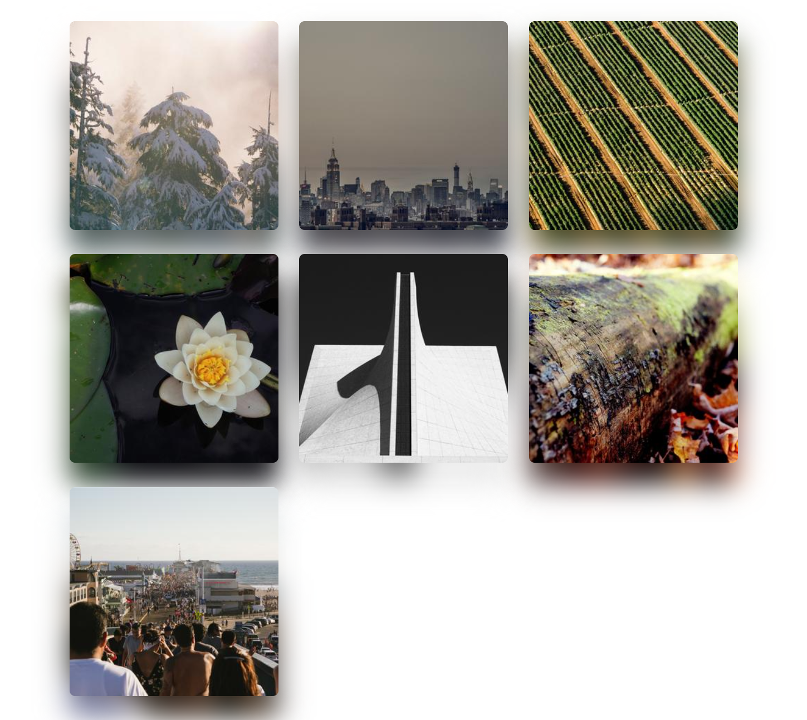
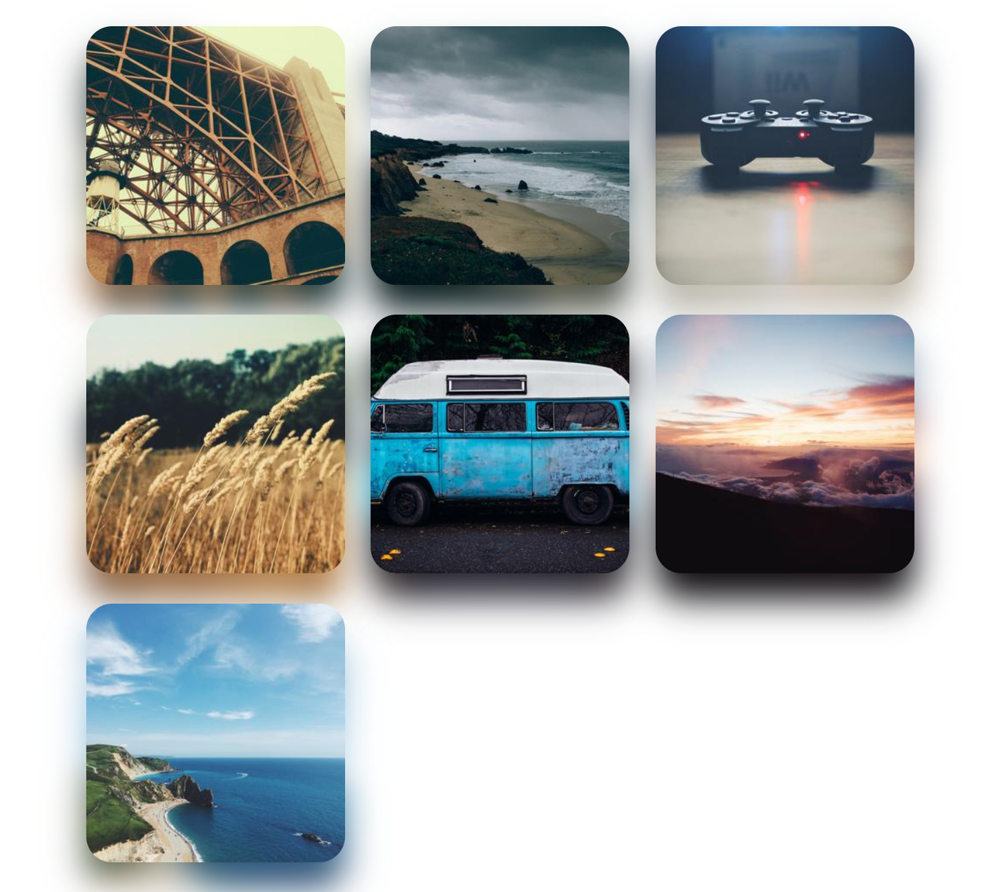
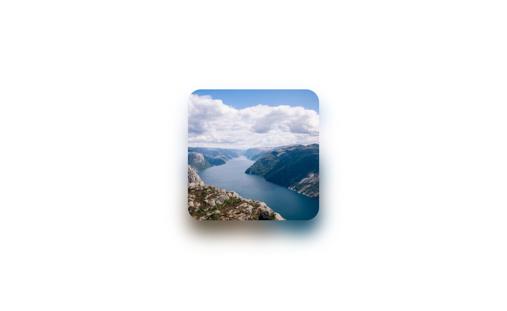

# Preview

|  |  |  |
| ------------ | ------------ | ------------ |

# Introduction

It helps you add appropriate shade to your images.

# Incorporate Into Your Project.

Include the JavaScript file inside the head tags.

```javascript
<script src="picture-shadow.js"></script>
```

Add the picture-shadow class to your image tags.

```html

```

If you use it this way, the shadow is created with the default properties.

# Customize

There are a few customization options for the shadow.

border radius, how far from the top it will be, how far from the left it will be, how blurry it will be. How big will it be.

We will add these properties to our tag, it will be `data-[option]="[value]"`.

`data-radius` - How round will the border be?

```html

```

`data-left` - how far from the left?

```html

```

`data-top` - how far from the top?

```html

```

`data-blur` - how blurry it will be?

```html

```

`data-scale` - Resizes the shadow.

**< 1**: makes the image smaller than its size.

**1**: full size.

**\> 1**: makes the image larger than its size.

```html

```

One or more options can be selected.

There is nothing else you need to do, the shadow will be created automatically when your page is ready.

# How does it work

**This section is for information.**

First, let's say you have an image tag like this.

```html

```

When your page is ready we will first wrap it with a div. Then we will create another one from the picture inside. We use the second image we created as a shadow.

The state of your page after it is ready.

```html
<div class="picture-shadow-wrapper">
    
    
</div>
```
